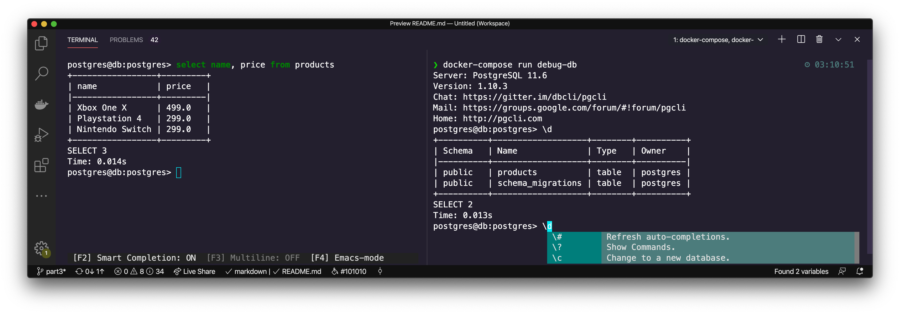
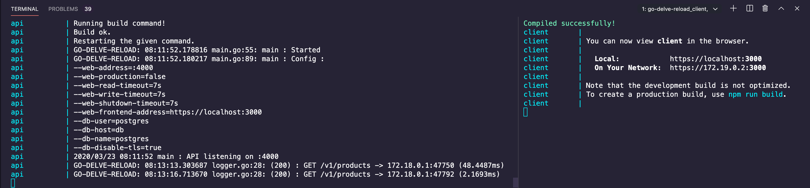

# The Go and React Series

## Deploying with Swarm and Traefik pt.5

>Unfortunately I stopped this blog series at part 3. The code here would have been part 5. Part 4 doesn't exist.

## Contents

- Digital Ocean
- Docker Hub
- Docker Machine
- Docker Swarm
- Healthchecks
- Traefik
- Deployment

### Requirements

- VSCode
- Docker
- DockerHub Account
- Digital Ocean Account
- A Domain Name (Try Namecheap)
- Docker Machine
- Managed Database (ElephantSQL is Free)

## Getting Started

```
git clone https://github.com/ivorscott/go-delve-reload
cd go-delve-reload
git checkout part5
```

Please review [Setting Up VSCode](/ultimate-go-react-development-setup-with-docker#go-modules) to avoid intellisense errors in VSCode. This occurs because the project is a mono repo and the Go module directory is not the project root.

### Usage

1 - Copy .env.sample and rename it to .env

The contents of .env should look like this:

```bash
# ENVIRONMENT VARIABLES

API_PORT=4000
PPROF_PORT=6060
CLIENT_PORT=3000

DB_URL=postgres://postgres:postgres@db:5432/postgres?sslmode=disable

REACT_APP_BACKEND=http://localhost:4000/v1
API_WEB_FRONTEND_ADDRESS=https://localhost:3000
```

2 - Unblock port 5432 for postgres

3 - Create self-signed certificates

The next set of commands moves generated certificates to the `./api/tls/` directory.

```makefile
mkdir -p ./api/tls
go run $(go env GOROOT)/src/crypto/tls/generate_cert.go --rsa-bits=2048 --host=localhost
mv *.pem ./api/tls
```

4 - Setup up the Postgres container

Run the database in the background.

```makefile
docker-compose up -d db
```

#### Create your first migration

Make a migration to create the products table.

```makefile
docker-compose run migration create_products_table
```

Add sql to both `up` & `down` migrations files found at: `./api/internal/schema/migrations/`.

**Up**

```sql
-- 000001_create_products_table.up.sql

CREATE TABLE products (
    id UUID not null unique,
    name varchar(100) not null,
    price real not null,
    description varchar(100) not null,
    created timestamp without time zone default (now() at time zone 'utc')
);
```

**Down**

```sql
-- 000001_create_products_table.down.sql

DROP TABLE IF EXISTS products;
```

#### Create your second migration

Make another migration to add tags to products:

```
docker-compose run migration add_tags_to_products
```

**Up**

```sql

-- 000002_add_tags_to_products.up.sql

ALTER TABLE products
ADD COLUMN tags varchar(255);
```

**Down**

```sql
-- 000002_add_tags_to_products.down.sql

ALTER TABLE products
DROP Column tags;
```

Migrate up to the latest migration

```makefile
docker-compose run up # you can migrate down with "docker-compose run down"
```

Display which version you have selected. Expect it two print `2` since you created 2 migrations.

```makefile
docker-compose run version
```

[Learn more about my go-migrate Postgres helper](https://github.com/ivorscott/go-migrate-postgres-helper)

#### Seeding the database

Create a seed file of the appropriate name matching the table name you wish to seed.

```makefile
touch ./api/internal/schema/seeds/products.sql
```

This adds an empty products.sql seed file found under `./api/internal/schema/seeds`. Add the following sql content:

```sql
-- ./api/internal/schema/seeds/products.sql

INSERT INTO products (id, name, price, description, created) VALUES
('cbef5139-323f-48b8-b911-dc9be7d0bc07','Xbox One X', 499.00, 'Eighth-generation home video game console developed by Microsoft.','2019-01-01 00:00:01.000001+00'),
('ce93a886-3a0e-456b-b7f5-8652d2de1e8f','Playstation 4', 299.00, 'Eighth-generation home video game console developed by Sony Interactive Entertainment.','2019-01-01 00:00:01.000001+00'),
('faa25b57-7031-4b37-8a89-de013418deb0','Nintendo Switch', 299.00, 'Hybrid console that can be used as a stationary and portable device developed by Nintendo.','2019-01-01 00:00:01.000001+00')
ON CONFLICT DO NOTHING;
```

Conflicts may arise when you execute the seed file more than once to the database. Appending "ON CONFLICT DO NOTHING;" to the end prevents this. This functionality depends on at least one table column having a unique constraint. In our case id is unique.

Finally, add the products seed to the database.

```
docker-compose exec db psql postgres postgres -f /seed/products.sql
```

Enter the database and examine its state.

```makefile
docker-compose run debug-db
```



If the database container is removed, you don't need to start from scratch. A named volume was created to persist the data. Simply run the container in the background again.

5 - Run the api and client containers

#### Run the Go API container with live reload enabled

`docker-compose up api`

#### Run the React TypeScript app container

`docker-compose up client`



or `docker-compose up api client`

First, navigate to the API in the browser at: <https://localhost:4000/v1/products>.

Then navigate to the client app at: <https://localhost:3000> in a separate tab.
This approach to development uses containers entirely.

**Note:**

To replicate the production environment as much as possible locally, we use self-signed certificates.

In your browser, you may see a warning and need to click a link to proceed to the requested page. This is common when using self-signed certificates.

6 - **Optional Idiomatic Go development** (container free Go API)

Another approach is to containerize only the client and database. Work with the API in an idiomatic fashion. This means without a container and with live reloading disabled. To configure the API, use command line flags or export environment variables.

```makefile
export API_DB_DISABLE_TLS=true
cd api
go run ./cmd/api
# go run ./cmd/api --db-disable-tls=true
```

### Try it in Postman

**List products**

GET <https://localhost:4000/v1/products>

**Retrieve one product**

GET <https://localhost:4000/v1/products/:id>

**Create a product**

POST <https://localhost:4000/v1/products>

```
{
	"name": "Game Cube",
	"price": 74,
	"description": "The GameCube is the first Nintendo console to use optical discs as its primary storage medium.",
	"tags": null
}
```

**Update a product**

PUT <https://localhost:4000/v1/products/:id>

```
{
	"name": "Nintendo Rich!"
}
```

**Delete a product**

DELETE <https://localhost:4000/v1/products/:id>

#### Commands

```makefile

docker-compose up api # develop api with live reload

docker-compose up client # develop client react app

docker-compose up -d db # start the database in the background

docker-compose run debug-db # use pgcli to inspect postgres db

docker-compose run migration <name> # create a migration

docker-compose run version # print current migration version

docker-compose run up <number> # migrate up a number (optional number, defaults to latest migration)

docker-compose run down <number> # migrate down a number (optional number, defaults to 1)

docker-compose run force <version> # Set version but don't run migration (ignores dirty state)

docker-compose exec db psql postgres postgres -f /seed/<name>.sql  # insert seed file to database

make build # build production ready images

make login # login to Docker Hub

make publish # publish to Docker Hub

make deploy # perform "docker stack deploy"

make metrics # enable Docker engine metrics

make secrets # create Docker swarm secrets

make server # create digital ocean server

make server-d # destroy digital ocean server

make swarm # create single node Swarm cluster
```

#### Using the debugger in VSCode

If you wish to debug with Delve you can do this in a separate container instance on port 8888 automatically.

```makefile
docker-compose up debug-api
```

Set a break point on a route handler. Click 'Launch remote' then visit the route in the browser.

[Read previous tutorial about delve debugging](https://blog.ivorscott.com/ultimate-go-react-development-setup-with-docker#delve-debugging-a-go-api)

#### VSCode launch.json

```
{
  "version": "0.2.0",
  "configurations": [
    {
      "name": "Launch remote",
      "type": "go",
      "request": "attach",
      "mode": "remote",
      "cwd": "${workspaceFolder}/api",
      "remotePath": "/api",
      "port": 2345,
      "showLog": true,
      "trace": "verbose"
    }
  ]
}
```
