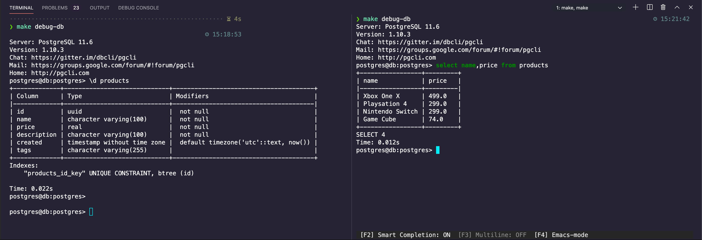

# go-delve-reload

## The Ultimate Go and React Development Setup with Docker (Part 2)

### Building A Better API

This repository is paired with a [blog post](https://blog.ivorscott.com/ultimate-go-react-development-setup-with-docker-part2). Part 2 is heavily influenced by [Ardan labs service training](https://github.com/ardanlabs/service-training). I highly recommend their [courses](https://education.ardanlabs.com/).

[Previous blog post](https://blog.ivorscott.com/ultimate-go-react-development-setup-with-docker)

## Contents

- Setup Changes From Part 1
- Graceful Shutdown
- Seeding & Migrations (With Go-Migrate)
- Package Oriented Design
- Fluent SQL Generation (With Squirrel)
- Error Handling
- Cancellation
- Request Validation
- Request Logging
- Integration Testing (With TestContainers-Go)

### Setup Changes From Part 1

<details>
  <summary>See changes</summary>

  <br/>

1 - Removed Traefik

Traefik will make its way back in production. It's not necessary in development because `create-react-app` and the `net/http` package both have mechanisms to use self signed certificates. This change actually speeds up our workflow. In `create-react-app`, inside `package.json` we can enable https by adding an additional argument `HTTPS=true` behind the start command.

```json
// package.json

"scripts": {
    "start": "HTTPS=true node scripts/start.js",
    "build": "node scripts/build.js",
    "test": "node scripts/test.js"
  },
```

In Golang, we use the `crypto` package to generate a cert with `make` or `make cert`.

```makefile
# makefile

cert:
	mkdir -p ./api/tls
	@go run $(GOROOT)/src/crypto/tls/generate_cert.go --rsa-bits=2048 --host=localhost
	@mv *.pem ./api/tls
```

We only use self-signed certificates in development, in production we will use Traefik.

```go
// main.go

	// Start the service listening for requests.
	go func() {
		log.Printf("main : API listening on %s", api.Addr)
		if cfg.Web.Production {
			serverErrors <- api.ListenAndServe()
		} else {
			serverErrors <- api.ListenAndServeTLS("./tls/cert.pem", "./tls/key.pem")
		}
	}()
```

2 - Cleaner terminal logging

In development, we can disable server error logging to avoid seeing "tls: unknown certificate" errors caused by self-signed certificates.

```go
// main.go

	var errorLog *log.Logger

	if !cfg.Web.Production {
		// Prevent the HTTP server from logging stuff on its own.
		// The things we care about we log ourselves from the handlers.
		// This prevents "tls: unknown certificate" errors caused by self-signed certificates
		errorLog = log.New(ioutil.Discard, "", 0)
	}

	api := http.Server{
		Addr:         cfg.Web.Address,
		Handler:      c.Handler(mux),
		ReadTimeout:  cfg.Web.ReadTimeout,
		WriteTimeout: cfg.Web.WriteTimeout,
		ErrorLog:     errorLog,
	}
```

CompileDaemon also cluttered terminal logging.

Docker-compose prints informational messages to stderr, and container output to the same stream as it was written to in the container (stdout or stderr) [Issue #2115](https://github.com/docker/compose/issues/2115#issuecomment-193420167). So CompileDaemon was displaying an "stderr:" prefix in all container logs. This was fixed
with an additional command line flag to turn off the log prefix: `-log-prefix=false`.

```yaml
# docker-compose.yml

command: CompileDaemon --build="go build -o main ./cmd/api" -log-prefix=false --command=./main
```

3 - Added the ArdanLabs [configuration package](https://github.com/ardanlabs/conf)

This package provides support for using environmental variables and command line arguments for configuration.

The struct field `cfg.Web.Production` for example, can be represented as `--web-production` in cli flag form or
`API_WEB_PRODUCTION` in environment variable form. When in environment variable form there is an extra namespace to
reduce possible name conflicts in our case that namespace is `API`.

```go
// main.go

	// =========================================================================
	// Configuration

	var cfg struct {
		Web struct {
			Address            string        `conf:"default:localhost:4000"`
			Production         bool          `conf:"default:false"`
			ReadTimeout        time.Duration `conf:"default:5s"`
			WriteTimeout       time.Duration `conf:"default:5s"`
			ShutdownTimeout    time.Duration `conf:"default:5s"`
			FrontendAddress    string        `conf:"default:https://localhost:3000"`
		}
		DB struct {
			User       string `conf:"default:postgres"`
			Password   string `conf:"default:postgres,noprint"`
			Host       string `conf:"default:localhost"`
			Name       string `conf:"default:postgres"`
			DisableTLS bool   `conf:"default:true"`
		}
	}

	if err := conf.Parse(os.Args[1:], "API", &cfg); err != nil {
		if err == conf.ErrHelpWanted {
			usage, err := conf.Usage("API", &cfg)
			if err != nil {
				log.Fatalf("error : generating config usage : %v", err)
			}
			fmt.Println(usage)
			return
		}
		log.Fatalf("error: parsing config: %s", err)
	}

```

```yaml
# docker-compose.yml

services:
  api:
    build:
      context: ./api
      target: dev
    container_name: api
    environment:
      CGO_ENABLED: 0
      API_DB_HOST: db
      API_WEB_PRODUCTION: "false"
      API_WEB_ADDRESS: :$API_PORT
      API_WEB_READ_TIMEOUT: 7s
      API_WEB_WRITE_TIMEOUT: 7s
      API_WEB_SHUTDOWN_TIMEOUT: 7s
      API_WEB_FRONTEND_ADDRESS: https://localhost:$CLIENT_PORT
    ports:
      - $API_PORT:$API_PORT
```

4 - Removed Docker Secrets from Development

Docker Secrets will still be supported, just not in development. In development, we now use an .env file instead.
Docker secrets are a Swarm specific construct. They aren't really secret in docker-compose anyway [PR #4368](https://github.com/docker/compose/pull/4368). Docker-compose just doesn't complain when it sees them. This was necessary to ensure our application could support them in the future, when we start working with Docker Swarm in Production.

Now Docker secrets are only supported when we pass a truthy Production environment argument.

```go
// main.go

	// =========================================================================
	// Enabled Docker Secrets

	if cfg.Web.Production {
		dockerSecrets, err := secrets.NewDockerSecrets()
		if err != nil {
			log.Fatalf("error : retrieving docker secrets failed : %v", err)
		}

		cfg.DB.Name = dockerSecrets.Get("postgres_db")
		cfg.DB.User = dockerSecrets.Get("postgres_user")
		cfg.DB.Host = dockerSecrets.Get("postgres_host")
		cfg.DB.Password = dockerSecrets.Get("postgres_passwd")
	}

```

5 - Removed PgAdmin4

If you're going to use pgAdmin4 you're better off using it on your host machine without a container. It's more reliable
and not a pain to configure. Importing and exporting sql files was extremely difficult when dealing with the containerized version.

6 - Enabled Idiomatic Go development

Containerizing the go api is now optional. Dave Cheney made me do it:

"Folks, keep docker out of your edit/compile/test inner loop."

-- https://twitter.com/davecheney/status/1232078682287591425

I think it really depends on what you're trying to achieve.

My reasons for using Docker:

1. Custom Workflows
2. Predictability Across Machines
3. Isolated Environments
4. Optional Live Reloading
5. Optional Delve Debugging
6. Integration Testing In CI
7. Preparation For Deployments

These benefits should be investigated, case by case. They deserve investment.

</details>

### Prerequisites

[Setting up VSCode](https://blog.ivorscott.com/ultimate-go-react-development-setup-with-docker#setting-up-vscode)

### Requirements

- VSCode
- Postman
- Docker

### Usage

1 - Copy the .env.sample file and rename it to .env.

```bash
# DEVELOPMENT ENVIRONMENT VARIABLES

API_PORT=4000
CLIENT_PORT=3000

POSTGRES_DB=postgres
POSTGRES_USER=postgres
POSTGRES_PASSWORD=postgres
POSTGRES_HOST=db
POSTGRES_NET=postgres-net
```

2 - Unblock port 5432 for postgres

The makefile commands and our docker-compose yaml file reference the standard 5432 port for postgres.
Before continuing, close all existing postgres connections.

With homebrew for example, if you installed `postgresql@10` execute
`brew info postgresql@10` to generate information on how to start/stop the service. If you don't know what version you installed run `brew list`.

For example, on my machine I did:

```bash
pg_ctl -D /usr/local/var/postgresql@10 stop
killall postgresql
```

3 - Create self-signed certificates

```makefile
make cert # moves generated certs to ./api/tls/
```

4 - Setup up the Postgres container

```makefile
make db # runs database in the background
make migration create_products_table
```

Then add sql to both up & down migrations files found under: `./api/internal/schema/migrations/`.

```sql
-- 000001_create_products_table.up.sql

CREATE TABLE products (
    id UUID not null unique,
    name varchar(100) not null,
    price real not null,
    description varchar(100) not null,
    created timestamp without time zone default (now() at time zone 'utc')
);
```

```sql
-- 000001_create_products_table.down.sql

DROP TABLE IF EXISTS products;
```

Make another migration to add tags to products:

```
make migration add_tags_to_products
```

```sql

-- 000002_add_tags_to_products.up.sql

ALTER TABLE products
ADD COLUMN tags varchar(255);
```

```sql
-- 000002_add_tags_to_products.down.sql

ALTER TABLE products
DROP Column tags;
```

Migrate up to the latest migration

```makefile
make up # you can migrate down with "make down"
```

Display which version you have selected:

```makefile
make version
```

[Learn more about my go-migrate postgres helper](https://github.com/ivorscott/go-migrate-postgres-helper)

Next we need to seed the database:

```makefile
make seed products
```

This adds an empty products.sql seed file found under `./api/internal/schema/seeds`. Add some rows:

```sql
-- ./api/internal/schema/seeds/products.sql

INSERT INTO products (id, name, price, description, created) VALUES
('cbef5139-323f-48b8-b911-dc9be7d0bc07','Xbox One X', 499.00, 'Eighth-generation home video game console developed by Microsoft.','2019-01-01 00:00:01.000001+00'),
('ce93a886-3a0e-456b-b7f5-8652d2de1e8f','Playsation 4', 299.00, 'Eighth-generation home video game console developed by Sony Interactive Entertainment.','2019-01-01 00:00:01.000001+00'),
('faa25b57-7031-4b37-8a89-de013418deb0','Nintendo Switch', 299.00, 'Hybrid console that can be used as a stationary and portable device developed by Nintendo.','2019-01-01 00:00:01.000001+00')
ON CONFLICT DO NOTHING;
```

Appending "ON CONFLICT DO NOTHING;" to the end of the sql command prevents conflicts if the seed file is executed to the database more than once. **Note:** This behavior works because the products table has at least one table column with a unique constraint.

Finally, add the products seed file to the database

```
make insert products
```

Enter the database and examine its state

```makefile
make debug-db
```



5 - In a terminal, and under the project root, execute the commands:

```makefile
make api # develop the api with live reloading
make client # develop the client app in a separate terminal
```


6 - Navigate to https://localhost:4000/v1/products and https://localhost:3000 in two separate tabs.

This approach to development uses containers entirely.

**Note:**

To replicate the production environment as much as possible locally, we use self-signed certificates.

In your browser, you may see a warning and need to click a link to proceed to the requested page. This is common when using self-signed certificates.

7 - **Idiomatic Go development** (container free go api)

Another option is to only containerize the client and database. This approach
allows you to work with the go api in an idiomatic fashion, with command line flags
to configure the api and without live reloading on code changes.

```makefile
export API_DB_DISABLE_TLS=true
cd api
go run ./cmd/api
# go run ./cmd/api --db-disable-tls=true
```

### Try it in Postman

#### List products

GET https://localhost:4000/v1/products

#### Retrieve one product

GET https://localhost:4000/v1/products/cbef5139-323f-48b8-b911-dc9be7d0bc07

### Create a product

POST https://localhost:4000/v1/products

example data:

```
{
	"name": "Game Cube",
	"price": 74,
	"description": "The GameCube is the first Nintendo console to use optical discs as its primary storage medium.",
	"tags": null
}
```

7 - Debugging

If you wish to debug with Delve you can do this in a separate container instance on port 8888 automatically.

```makefile
make debug-api
```

[Read previous tutorial about delve debugging](https://blog.ivorscott.com/ultimate-go-react-development-setup-with-docker#delve-debugging-a-go-api)

#### Commands

```makefile

make api # develop api with live reload

make cert # generate self-signed certificates

make client # develop client react app

make db # start the database in the background

make debug-api # use delve on the same api in a separate container (no live reload)

make debug-db # use pgcli to inspect postgres db

make rm # remove all containers

make rmi # remove all images

make exec user="..." service="..." cmd="..." # execute command in running container

make tidy # clean up unused api dependencies

make test-api # run api tests

make test-client # run client tests

make test-client-watch # run client tests and watch

make migration <name> # create a migration

make version # print current migration version

make up <number> # migrate up a number (optional number, defaults to latest migration)

make down <number> # migrate down a number (optional number, defaults to 1)

make force <version> # Set version but don't run migration (ignores dirty state)

make seed <name> # create seed filename

make insert <name> # insert seed file to database
```

#### Using the debugger in VSCode

Run the debuggable api. Set a break point on a route handler. Click 'Launch remote' then visit the route in the browser.

#### VSCode launch.json

```
{
  "version": "0.2.0",
  "configurations": [
    {
      "name": "Launch remote",
      "type": "go",
      "request": "attach",
      "mode": "remote",
      "cwd": "${workspaceFolder}/api",
      "remotePath": "/api",
      "port": 2345,
      "showLog": true,
      "trace": "verbose"
    }
  ]
}

```

## The Ultimate Go and React Series

### Building A Workflow

[The Ultimate Go and React Development Setup with Docker (Part 1)](https://blog.ivorscott.com/ultimate-go-react-development-setup-with-docker)

<details>

  <summary>See content</summary>

  <br/>

- VSCode Setup
- Docker Basics
- Multi-stage Builds
- Docker Compose
- Using Makefiles
- Using Postgres
- Using Traefik
- Live Reloading a Go API
- Delve Debugging a Go API
- Testing

</details>

### Building A Better API

The Ultimate Go and React Development Setup with Docker (Part 2)

<details>
  <summary>See content</summary>

  <br/>

- Setup Changes From Part 1
- Graceful Shutdown
- Seeding & Migrations (With Go-Migrate)
- Package Oriented Design
- Fluent SQL Generation (With Squirrel)
- Error Handling
- Cancellation
- Request Validation
- Request Logging
- Integration Testing (With TestContainers-Go)

</details>

### Security and Awareness: OAuth, Observability, And Profiling

The Ultimate Go and React Development Setup with Docker (Part 3)

<details>
  <summary>See content</summary>

  <br/>

- Health checks
- Profiling
- Open Telemetry
- OAuth & Auth0
- Authentication
- Authorization

</details>

### Docker Swarm and Traefik

The Ultimate Go and React Production Setup with Docker (Part 4)

<details>
  <summary>See content</summary>

  <br/>
  
- Docker Hub
- Docker Swarm
- Swarm Secrets
- Digital Ocean
- Managed Databases
- Volume Storage Plugins
- Traefik

</details>

### Continuous Integration And Continuous Delivery

The Ultimate Go and React Production Setup with Docker (Part 5)

<details>
  <summary>See content</summary>

  <br/>

- Drone CI
- Portainer

</details>
