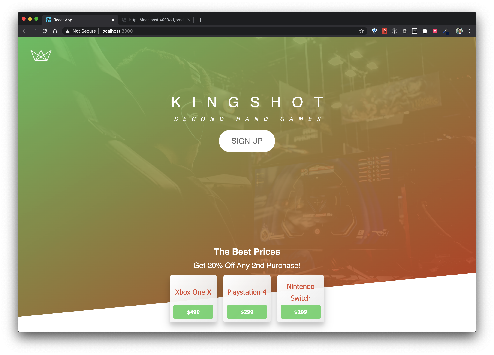
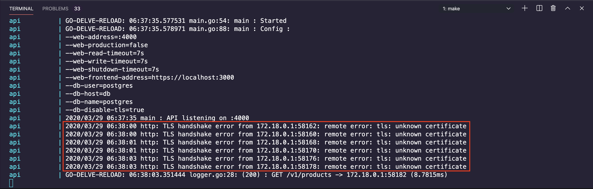
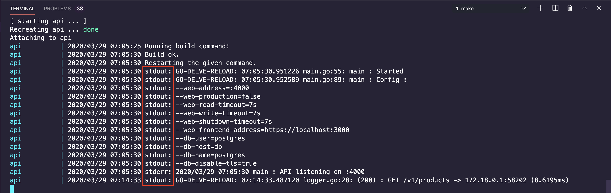

# The Go and React Series

## My API Workflow with Go pt.3

This repository is paired with a [blog post](https://medium.com/swlh/my-api-workflow-with-go-pt-3-c0b7f808a38b).

[](https://ko-fi.com/G2G01SD6G)



Many improvements in Part 3 originate from [Ardan labs service training](https://github.com/ardanlabs/service-training).

## Contents

- Configuration
- Docker Secrets
- Graceful Shutdown
- Middleware
- Handling Requests
- Error Handling
- Seeding & Migrations (With Go-Migrate)
- Integration Testing (With TestContainers-Go)
- Profiling

### Improvements to Part 1

<details>
  <summary>See changes</summary>

  <br/>

1 - Removed Traefik from development

If you recall, the previous post used Traefik for self-signed certificates. We're no longer using Traefik in development. We'll use it in production. `create-react-app` and the `net/http` packages both have mechanisms to use self signed-certificates. This cleans up our docker-compose file and speeds up the workflow. Now we don't need to pull the Traefik image or run the container. In the client app we enable self-signed certificates by adding `HTTPS=true` to the `package.json`.

```json
// package.json

"scripts": {
    "start": "HTTPS=true node scripts/start.js",
    "build": "node scripts/build.js",
    "test": "node scripts/test.js"
  },
```

In Go, we can use the `crypto` package to generate a certs.

```makefile
mkdir -p ./api/tls
go run $(go env GOROOT)/src/crypto/tls/generate_cert.go --rsa-bits=2048 --host=localhost
mv *.pem ./api/tls
```

The following demonstrates how we can switch between self-signed certificates and Traefik. When `cfg.Web.Production` is true, we are using Traefik. In a later post, we will have a separate Traefik compose file for production deployments.

```go
// main.go

	// Start the service listening for requests.
	go func() {
		log.Printf("main : API listening on %s", api.Addr)
		if cfg.Web.Production {
			serverErrors <- api.ListenAndServe()
		} else {
			serverErrors <- api.ListenAndServeTLS("./tls/cert.pem", "./tls/key.pem")
		}
	}()
```

2 - Cleaner terminal logging

Using self-signed certificates produces ugly logs.



We can avoid the `tls: unknown certificate` message by disabling server error logging. It's ok to do this in development. The things we do care about print from logging and error middleware. When `cfg.Web.Production` is false, a new error logger will discard server logs.

```go
// main.go

	var errorLog *log.Logger

	if !cfg.Web.Production {
		// Prevent the HTTP server from logging stuff on its own.
		// The things we care about we log ourselves.
		// Prevents "tls: unknown certificate" errors caused by self-signed certificates.
		errorLog = log.New(ioutil.Discard, "", 0)
	}

	api := http.Server{
		Addr:         cfg.Web.Address,
		Handler:      c.Handler(mux),
		ReadTimeout:  cfg.Web.ReadTimeout,
		WriteTimeout: cfg.Web.WriteTimeout,
		ErrorLog:     errorLog,
	}
```

[CompileDaemon](https://github.com/githubnemo/CompileDaemon) created ugly logs as well. CompileDaemon prefixes all child process output with stdout or stderr labels.



```yaml
# docker-compose.yml

command: CompileDaemon --build="go build -o main ./cmd/api" -log-prefix=false --command=./main
```

3 - Added the Ardan Labs configuration package

In Part 1, API configuration came from environment variables in the docker-compose file. But it was dependent on docker secret values, making it harder to opt-out of docker in development. Furthermore, we didn't support any configuration tool for variables that weren't secret. I chose to reserve docker secrets for production and adopt the [Ardan Labs configuration package](https://github.com/ardanlabs/conf). The package supports both environment variables and command line arguments. Now we can opt-out of docker if we want a more idiomatic Go API development workflow. In doing this, we keep the integrity of our service. I copied and pasted the package directly under: `/api/internal/platform/conf`.

The package takes struct fields and translates them to cli flags and environment variables. The struct field `cfg.Web.Production` in cli form would be `--web-production`. But in environment variable form it is `API_WEB_PRODUCTION`. Notice as an environment variable there's an extra namespace. This ensures we only parse the vars we expect. This also reduces name conflicts. In our case that namespace is `API`.

```go
// main.go

// =========================================================================
// Configuration

var cfg struct {
  Web struct {
    Address            string        `conf:"default:localhost:4000"`
    Production         bool          `conf:"default:false"`
    ReadTimeout        time.Duration `conf:"default:5s"`
    WriteTimeout       time.Duration `conf:"default:5s"`
    ShutdownTimeout    time.Duration `conf:"default:5s"`
    FrontendAddress    string        `conf:"default:https://localhost:3000"`
  }
  DB struct {
    User       string `conf:"default:postgres"`
    Password   string `conf:"default:postgres,noprint"`
    Host       string `conf:"default:localhost"`
    Name       string `conf:"default:postgres"`
    DisableTLS bool   `conf:"default:true"`
  }
}

```

The configuration package requires a nested struct describing the configuration fields. Each field has a type and default value supplied in a struct tag. Next we parse the arguments, as environment variables or command line flags:

```go
if err := conf.Parse(os.Args[1:], "API", &cfg); err != nil {
  if err == conf.ErrHelpWanted {
    usage, err := conf.Usage("API", &cfg)
    if err != nil {
      log.Fatalf("error : generating config usage : %v", err)
    }
    fmt.Println(usage)
    return
  }
  log.Fatalf("error: parsing config: %s", err)
}
```

If there's an error we either reveal usage instructions or throw a fatal error. The next snippet shows the same configuration fields in our docker-compose file with the API namespace:

```yaml
# docker-compose.yml

services:
  api:
    build:
      context: ./api
      target: dev
    container_name: api
    environment:
      CGO_ENABLED: 0
      API_DB_HOST: db
      API_WEB_PRODUCTION: "false"
      API_WEB_ADDRESS: :$API_PORT
      API_WEB_READ_TIMEOUT: 7s
      API_WEB_WRITE_TIMEOUT: 7s
      API_WEB_SHUTDOWN_TIMEOUT: 7s
      API_WEB_FRONTEND_ADDRESS: https://localhost:$CLIENT_PORT
    ports:
      - $API_PORT:$API_PORT
```

When necessary we may abstract some environment variables into a centralized location and pull them in. When an `.env` file exists in the same directory as the docker-compose file, we can reference its vars. To do this, prefix a dollar sign before the environment variable name. For example: `$API_PORT` or `$CLIENT_PORT`. This allows for better maintenance of configuration defaults, especially when values are referenced in multiple places.

4 - Removed Docker Secrets from Development

Docker secrets are a Swarm specific construct. They aren't secret in docker-compose anyway [PR #4368](https://github.com/docker/compose/pull/4368). This only works because docker-compose isn't complaining when it sees them. Now Docker secrets are only supported when `cfg.Web.Production` is true. When this happens we swap out the default database configuration with secrets.

```go
// main.go

	// =========================================================================
	// Enabled Docker Secrets

	if cfg.Web.Production {
		dockerSecrets, err := secrets.NewDockerSecrets()
		if err != nil {
			log.Fatalf("error : retrieving docker secrets failed : %v", err)
		}

		cfg.DB.Name = dockerSecrets.Get("postgres_db")
		cfg.DB.User = dockerSecrets.Get("postgres_user")
		cfg.DB.Host = dockerSecrets.Get("postgres_host")
		cfg.DB.Password = dockerSecrets.Get("postgres_passwd")
	}

```

More on Docker secrets when we get to production in a later post.

5 - Removed PgAdmin4

PgAdmin4 is one of many Postgres editors available. For example, I've enjoyed using SQLPro Studio at work. If you're going to use PgAdmin4 or any other editor, use it on your host machine without a container. Reason being, it's more reliable. Importing and exporting sql files is difficult in a PgAdmin4 container.

6 - Enabled Idiomatic Go development

Containerizing the Go API is now optional. This makes our development workflow even more flexible. This tweet made me consider the consequences of having the API too coupled to Docker:

"Folks, keep docker out of your edit/compile/test inner loop."

-- https://twitter.com/davecheney/status/1232078682287591425

In the end Docker should be optional and you should know your reasons for using it. My reasons are:

1. Custom Workflows
2. Predictability Across Machines
3. Isolated Environments
4. Optional Live Reloading
5. Optional Delve Debugging
6. Integration Testing In CI
7. Preparation For Deployments

7 - Removed Makefile

Since I'm teaching docker, I don't want to abstract away all the commands. docker-compose is already an abstraction around docker.
Makefiles tend to get long and complex. I don't want a single Makefile to become a central place for disparate concerns that teams can abuse. That being said I might use one for deployment only.

</details>

### Requirements

- VSCode
- Docker

## Getting Started

```
git clone https://github.com/ivorscott/go-delve-reload
cd go-delve-reload
git checkout part3
```

Please review [Setting Up VSCode](/ultimate-go-react-development-setup-with-docker#go-modules) to avoid intellisense errors in VSCode. This occurs because the project is a mono repo and the Go module directory is not the project root.

### Usage

1 - Copy .env.sample and rename it to .env

The contents of .env should look like this:

```bash
# ENVIRONMENT VARIABLES

API_PORT=4000
PPROF_PORT=6060
CLIENT_PORT=3000

DB_URL=postgres://postgres:postgres@db:5432/postgres?sslmode=disable

REACT_APP_BACKEND=http://localhost:4000/v1
API_WEB_FRONTEND_ADDRESS=https://localhost:3000
```

2 - Unblock port 5432 for postgres

3 - Create self-signed certificates

The next set of commands moves generated certificates to the `./api/tls/` directory.

```makefile
mkdir -p ./api/tls
go run $(go env GOROOT)/src/crypto/tls/generate_cert.go --rsa-bits=2048 --host=localhost
mv *.pem ./api/tls
```

4 - Setup up the Postgres container

Run the database in the background.

```makefile
docker-compose up -d db
```

#### Create your first migration

Make a migration to create the products table.

```makefile
docker-compose run migration create_products_table
```

Add sql to both `up` & `down` migrations files found at: `./api/internal/schema/migrations/`.

**Up**

```sql
-- 000001_create_products_table.up.sql

CREATE TABLE products (
    id UUID not null unique,
    name varchar(100) not null,
    price real not null,
    description varchar(100) not null,
    created timestamp without time zone default (now() at time zone 'utc')
);
```

**Down**

```sql
-- 000001_create_products_table.down.sql

DROP TABLE IF EXISTS products;
```

#### Create your second migration

Make another migration to add tags to products:

```
docker-compose run migration add_tags_to_products
```

**Up**

```sql

-- 000002_add_tags_to_products.up.sql

ALTER TABLE products
ADD COLUMN tags varchar(255);
```

**Down**

```sql
-- 000002_add_tags_to_products.down.sql

ALTER TABLE products
DROP Column tags;
```

Migrate up to the latest migration

```makefile
docker-compose run up # you can migrate down with "docker-compose run down"
```

Display which version you have selected. Expect it two print `2` since you created 2 migrations.

```makefile
docker-compose run version
```

[Learn more about my go-migrate Postgres helper](https://github.com/ivorscott/go-migrate-postgres-helper)

#### Seeding the database

Create a seed file of the appropriate name matching the table name you wish to seed.

```makefile
touch ./api/internal/schema/seeds/products.sql
```

This adds an empty products.sql seed file found under `./api/internal/schema/seeds`. Add the following sql content:

```sql
-- ./api/internal/schema/seeds/products.sql

INSERT INTO products (id, name, price, description, created) VALUES
('cbef5139-323f-48b8-b911-dc9be7d0bc07','Xbox One X', 499.00, 'Eighth-generation home video game console developed by Microsoft.','2019-01-01 00:00:01.000001+00'),
('ce93a886-3a0e-456b-b7f5-8652d2de1e8f','Playstation 4', 299.00, 'Eighth-generation home video game console developed by Sony Interactive Entertainment.','2019-01-01 00:00:01.000001+00'),
('faa25b57-7031-4b37-8a89-de013418deb0','Nintendo Switch', 299.00, 'Hybrid console that can be used as a stationary and portable device developed by Nintendo.','2019-01-01 00:00:01.000001+00')
ON CONFLICT DO NOTHING;
```

Conflicts may arise when you execute the seed file more than once to the database. Appending "ON CONFLICT DO NOTHING;" to the end prevents this. This functionality depends on at least one table column having a unique constraint. In our case id is unique.

Finally, add the products seed to the database.

```
docker-compose exec db psql postgres postgres -f /seed/products.sql
```

Enter the database and examine its state.

```makefile
docker-compose run debug-db
```


If the database container is removed, you don't need to start from scratch. A named volume was created to persist the data. Simply run the container in the background again.

5 - Run the api and client containers

#### Run the Go API container with live reload enabled

`docker-compose up api`

#### Run the React TypeScript app container

`docker-compose up client`


or `docker-compose up api client`

First, navigate to the API in the browser at: <https://localhost:4000/v1/products>.

Then navigate to the client app at: <https://localhost:3000> in a separate tab.
This approach to development uses containers entirely.

**Note:**

To replicate the production environment as much as possible locally, we use self-signed certificates.

In your browser, you may see a warning and need to click a link to proceed to the requested page. This is common when using self-signed certificates.

6 - **Optional Idiomatic Go development** (container free Go API)

Another approach is to containerize only the client and database. Work with the API in an idiomatic fashion. This means without a container and with live reloading disabled. To configure the API, use command line flags or export environment variables.

```makefile
export API_DB_DISABLE_TLS=true
cd api
go run ./cmd/api
# go run ./cmd/api --db-disable-tls=true
```

### Try it in Postman

**List products**

GET <https://localhost:4000/v1/products>

**Retrieve one product**

GET <https://localhost:4000/v1/products/:id>

**Create a product**

POST <https://localhost:4000/v1/products>

```
{
	"name": "Game Cube",
	"price": 74,
	"description": "The GameCube is the first Nintendo console to use optical discs as its primary storage medium.",
	"tags": null
}
```

**Update a product**

PUT <https://localhost:4000/v1/products/:id>

```
{
	"name": "Nintendo Rich!"
}
```

**Delete a product**

DELETE <https://localhost:4000/v1/products/:id>

#### Commands

```makefile

docker-compose up api # develop api with live reload

docker-compose up client # develop client react app

docker-compose up -d db # start the database in the background

docker-compose run debug-db # use pgcli to inspect postgres db

docker-compose run migration <name> # create a migration

docker-compose run version # print current migration version

docker-compose run up <number> # migrate up a number (optional number, defaults to latest migration)

docker-compose run down <number> # migrate down a number (optional number, defaults to 1)

docker-compose run force <version> # Set version but don't run migration (ignores dirty state)

docker-compose exec db psql postgres postgres -f /seed/<name>.sql  # insert seed file to database
```

#### Using the debugger in VSCode

If you wish to debug with Delve you can do this in a separate container instance on port 8888 automatically.

```makefile
docker-compose up debug-api
```

Set a break point on a route handler. Click 'Launch remote' then visit the route in the browser.

[Read previous tutorial about delve debugging](https://blog.ivorscott.com/ultimate-go-react-development-setup-with-docker#delve-debugging-a-go-api)

#### VSCode launch.json

```
{
  "version": "0.2.0",
  "configurations": [
    {
      "name": "Launch remote",
      "type": "go",
      "request": "attach",
      "mode": "remote",
      "cwd": "${workspaceFolder}/api",
      "remotePath": "/api",
      "port": 2345,
      "showLog": true,
      "trace": "verbose"
    }
  ]
}
```
